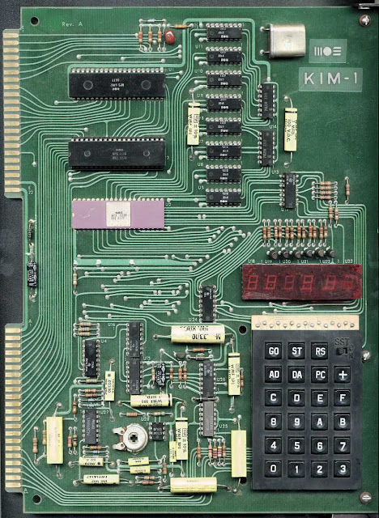
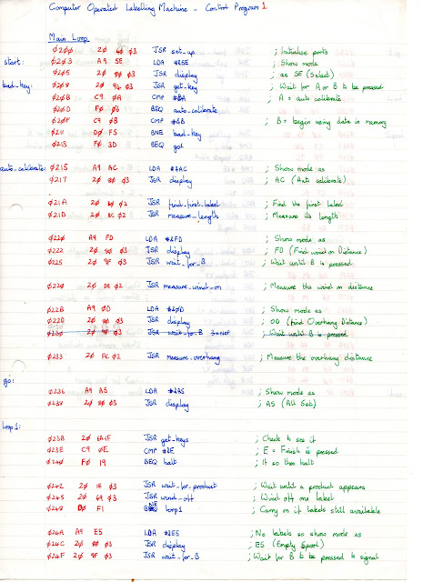
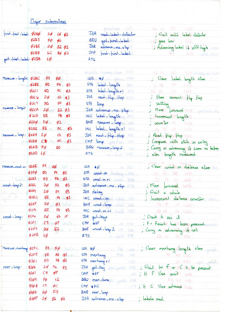

### How I coded in 1985

**[April 29, 2013](https://blog.jgc.org/2013/04/how-i-coded-in-1985.html)**

Back in 1985 I worked on the computerization of a machine designed to stick labels on bottles. The company that made the machines was using electromechanical controls to spool labels off a reel and onto products (such as bottles of shampoo) passing by on a conveyor. The entire thing needed to work with mm accuracy because consumers don't like labels that aren't perfectly aligned.

Unfortunately, electromechanical controls aren't as flexible as computer controls and so the company had contracted a local technical college (where I was studying electronics) to prototype computer control using a [KIM-1](https://en.wikipedia.org/wiki/KIM-1). Another student had put together the machine with a conveyor, a mechanism for delivering the labels, control of stepper motors, and infrared sensors for detecting labels and products.

My job was to write the software in 6502 assembly. Unfortunately, there wasn't an assembler and the KIM-1 just had a hex keypad and small display. So, it meant writing the code by hand, hand assembling and typing it in.  The code looked like this:

It was immediately obvious that computer control was going to be more flexible. The program first did automatic calibration: it measured the length of labels on the spool itself, it measured the distance between labels itself and it enabled an operator to quickly set up the 'overhang' distance (how much of the label is sticking out so the product can catch onto it.

While running it could automatically detect how fast the conveyor was moving and compensate, and spot when a label was missing from the supply spool (which happened when one peeled off by accident).

Of course, writing code like this is a pain. You first had to write the code (the blue), then turn it into machine code (the red) and work out memory locations for each instruction and relative jumps. At the time I didn't own a calculator capable of doing hex so I did most of the calculations needed (such as for relative jumps in my head).

But it taught me two things: to get it right the first time and to learn to run code in my own head.  The latter has remained important to this day. I continue to run code in my head when debugging, typically I reach for the brain debugger before gdb or similar. On the KIM-1 there were only the most basic debugging functions and I built a few into the program, but most of the debugging was done by staring at the output (on the hex display), the behaviour (of the steppers) and by running the code through in my head.

Here's the [full program](https://docs.google.com/file/d/0BwUohGCPTAlALUpDY1JGUTFxYUU/edit?usp=sharing) for the curious.

PS A number of people have pointed out that in 1985 the KIM-1 was far from the state of the art and we had lots of niceties like compilers etc. True. In fact, prior to this I had been programming using BASIC and ZASM (Z80 assembler) under CP/M, but you go to war with the army you have: the technical college had a KIM-1 to spare, it had good I/O and it thus it made a fine prototyping system for an embedded controller.
